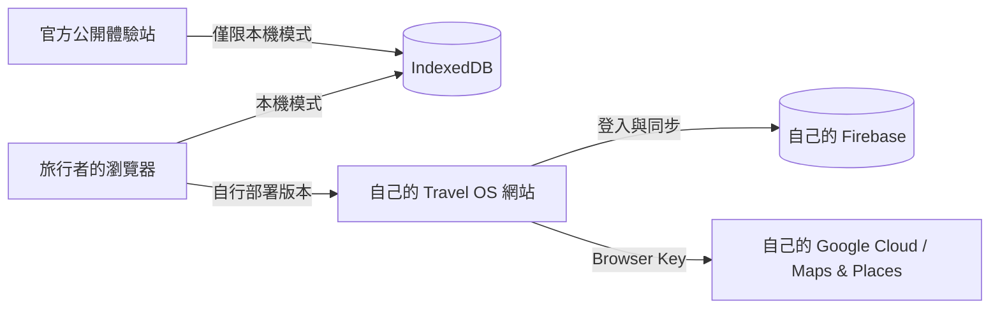

<p align="center">
  
</p>

<h1 align="center">Travel OS</h1>

<p align="center">
  <strong>行程可以很精彩，管理它不必很混亂。</strong><br />
  一個以使用者自有雲端同步為主軸、可自行部署、仍保有本機模式的開源旅遊規劃器。
</p>

<p align="center">
  <a href="https://github.com/fishingwithbag/Travel-OS/actions/workflows/ci.yml"></a>
  <a href="https://github.com/fishingwithbag/Travel-OS/actions/workflows/pages.yml"></a>
  <a href="https://github.com/fishingwithbag/Travel-OS/releases"></a>
  <a href="LICENSE"></a>
</p>

<p align="center">
  <a href="https://fishingwithbag.github.io/Travel-OS/"><strong>開啟本機體驗站</strong></a>
  ·
  <a href="docs/SELF_HOSTING.zh-TW.md"><strong>建立自己的網站</strong></a>
  ·
  <a href="docs/FIREBASE_SETUP.zh-TW.md"><strong>連接 Firebase</strong></a>
  ·
  <a href="docs/GOOGLE_CLOUD_SETUP.zh-TW.md"><strong>設定 Google Cloud</strong></a>
</p>

> [!IMPORTANT]
> 官方公開體驗站只開放 **IndexedDB 本機模式**，不接受 Firebase config、Google API key、Email 或密碼。需要雲端同步時，請先用 **Use this template** 建立由自己控制的網站副本。

## 為什麼做 Travel OS？

一趟旅行散落在很多地方：日期留在日曆、航班躺在信箱、住宿埋在聊天紀錄，費用則分散在不同幣別。整理它們不該再需要另一個會綁住資料的平台。

Travel OS 把每天的安排、航班、住宿、同行群組與費用放回同一張旅程工作台。自行部署後，第一次啟動會先引導你連接自己的 Firebase 與 Google Cloud，讓跨裝置與多人同步成為正式使用的主要模式；IndexedDB 則保留給公開 Demo、離線與暫時不連雲端的情境。你決定資料放在哪裡，也可以隨時完整匯出帶走。

## 旅程需要的，都在同一個地方

| 規劃 | 資料 | 使用體驗 |
|---|---|---|
| 🗓️ 跨月、跨年動態日期 | ☁️ 使用者自有 Firebase 雲端同步 | 📱 手機與桌面響應式介面 |
| ✈️ 分開記錄起降日期與時區 | 💾 IndexedDB 本機 fallback | ⌨️ 鍵盤可操作的表單與對話框 |
| 🏨 景點、餐飲、住宿、交通與航班 | 🔐 owner／editor／viewer Rules | 🌙 明暗主題與離線 app shell |
| 👥 任意數量的同行群組 | 📦 私人備份與分享副本 | 🗺️ 無 API key 仍可開啟 Google Maps 外部導航 |
| 💱 不混加不同幣別 | 🔄 匯入前預覽與 schema 驗證 | 🧭 GitHub Pages 子路徑可部署 |

每日行程的「下一個安排」會直接顯示備註、主要與備用停車場，並分開提供目的地與停車場的 Google Maps 導航。新增安排時可貼上自己的 Google Maps 分享連結；不貼連結時會搜尋地址或名稱。

## 建議使用方式

### 1. 建立自己的雲端 Travel OS（主流程）

1. 登入 GitHub，在本 repository 按 **Use this template → Create a new repository**。
2. Owner 選自己的 GitHub 帳號；Repository name 建議填 `Travel-OS`。GitHub Free 請使用 **Public** repository。
3. 建立後進入自己的 repository → **Settings → Pages → Build and deployment → Source → GitHub Actions**。
4. 到 **Actions** 等待 Pages workflow 成功，再回 **Settings → Pages → Visit site** 開啟自己的網站。網址通常是 `https://你的帳號.github.io/Travel-OS/`。
5. 第一次開啟自己的 Travel OS，網站會自動進入分步設定精靈，依序完成 **網站確認 → Firebase → Google Maps → Firebase 登入 → 自動驗證**。
6. 驗證完成後進入雲端模式，旅程以自己的 Firebase 為同步核心，可跨裝置並支援多人權限。

完整步驟請見[自行部署指南](docs/SELF_HOSTING.zh-TW.md)、[Firebase 設定指南](docs/FIREBASE_SETUP.zh-TW.md)與 [Google Cloud / Maps Key 指南](docs/GOOGLE_CLOUD_SETUP.zh-TW.md)。設定精靈本身也會逐步告訴你要開哪個官方頁面、按哪裡、填什麼，以及哪些選項不要選。

### 2. 本機模式（Demo／離線／暫時略過雲端）

開啟[公開體驗站](https://fishingwithbag.github.io/Travel-OS/)，不用登入、不用 API key。旅程保存在目前瀏覽器的 IndexedDB。自行部署版本在設定精靈也可以明確選擇「先使用本機模式」。

> [!TIP]
> 本機瀏覽器資料可能被使用者自行清除；本機模式請定期下載完整備份。

## 資料怎麼流動？



- 官方體驗站不開放雲端設定，避免使用者把憑證交給他人控制的前端。
- 自行部署版本把使用者自己的 Firebase 雲端同步當作 onboarding 主流程；本機模式是明確可選的 fallback。
- 「記住這台裝置」只保存公開 Firebase Web config 與受 Website/API restrictions 保護的 Browser Key，不保存密碼。
- Travel OS 拒絕 service account、Admin SDK 私鑰及 server secret。
- Firebase Rules 以 UID、`tripId` 和 membership 隔離資料。
- 設定精靈會驗證使用者自己的 Maps JavaScript／Places Browser Key。Browser Key 在瀏覽器中可見，因此一定要設定 Website restrictions、API restrictions 與 quota；Routes／Geocoding／Weather Server Key 必須留在使用者自己的後端。

更多細節請讀[資料與備份](docs/DATA_AND_BACKUPS.zh-TW.md)、[安全政策](SECURITY.md)及[共享體驗站架構決策](docs/decisions/003-shared-demo-local-only.md)。

## 本機開發

需要 Node.js 22 或相容版本：

```bash
git clone https://github.com/fishingwithbag/Travel-OS.git
cd Travel-OS
npm ci
npm run dev
```

Production build 使用相對資源路徑，同一份輸出可放在網域根目錄或 repository 子路徑。

## 品質與安全檢查

```bash
# 單元測試與 production build
npm run check

# Firebase Realtime Database Rules；需要 Java 21
npm run test:rules

# 自架者部署 Rules：先明確核准自己的 Firebase project，再部署
npm run firebase:rules:configure -- --project YOUR_PROJECT_ID
npm run firebase:rules:deploy

# 已知套件漏洞
npm audit --audit-level=high
```

GitHub Actions 會在每次 push 與 Pull Request 執行上述檢查。Rules 測試涵蓋未登入者、陌生人、viewer、editor、owner、權限提升與跨使用者索引。

OpenSource repository 沒有 production Firebase target，也禁止從 Firebase 帳號中的既有專案自動推測部署目標。Database deploy 會經過 `predeploy` boundary guard；完整設計見 [ADR-004](docs/decisions/004-firebase-deployment-boundary.md)。

## 專案地圖

```text
src/
├─ config/       執行時設定解析與部署防呆
├─ domain/       旅程資料模型、驗證與備份
├─ providers/    Google Maps 外部導航與 Browser Key 驗證
├─ storage/      IndexedDB 與 Firebase adapters
├─ app.js        介面流程與狀態
└─ styles.css    響應式視覺系統

firebase/        Realtime Database Rules
tests/           Domain、設定、儲存與權限測試
docs/            設定指南、資料說明與 ADR
```

## 目前狀態

Travel OS 正在公開 beta 階段。核心本機流程、備份、Firebase 權限、雲端設定精靈、Maps JavaScript／Places Browser Key 驗證及 Pages 部署已自動驗證。Places 地點搜尋／自動完成，以及 Routes／Geocoding／Weather 等進階能力仍待後續實作；正式 Firebase 與 Google Cloud 專案、Rules、API restrictions、配額與帳務都由每位自行部署者管理。

查看[版本紀錄](CHANGELOG.md)與 [Releases](https://github.com/fishingwithbag/Travel-OS/releases)了解每次更新。

## 一起把旅程工具做好

歡迎回報問題、改善文件或提出 Pull Request。提交前請閱讀[貢獻指南](CONTRIBUTING.md)，並確認示例不包含真實旅程、姓名、訂單、憑證或其他私人資料。

- [回報問題](https://github.com/fishingwithbag/Travel-OS/issues)
- [貢獻指南](CONTRIBUTING.md)
- [安全漏洞私密回報](SECURITY.md)
- [第三方授權與素材](THIRD_PARTY_NOTICES.md)

## License

Travel OS 採用 [MIT License](LICENSE)。你可以使用、修改及發布自己的版本；第三方套件仍依各自授權條款使用。

<p align="center">
  <sub>Plan freely. Keep your data. Travel your way.</sub>
</p>
